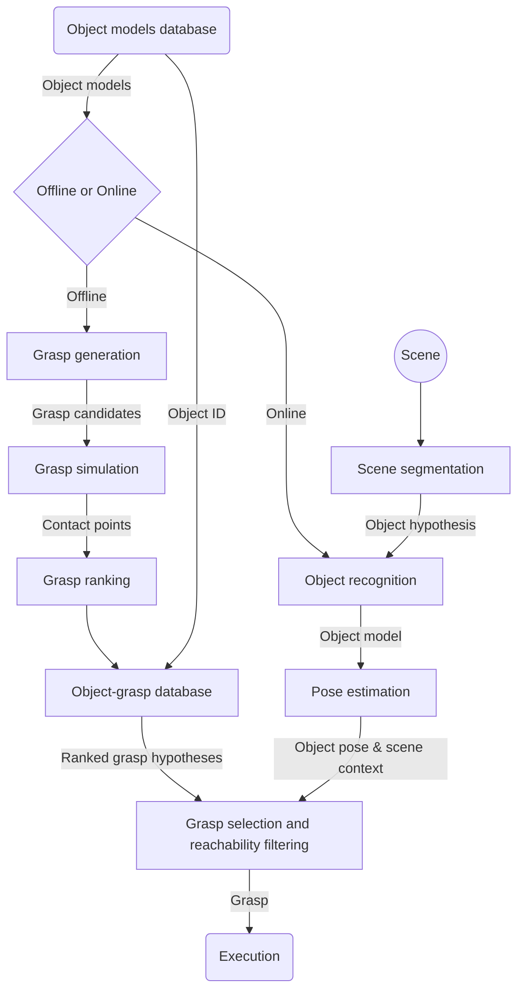
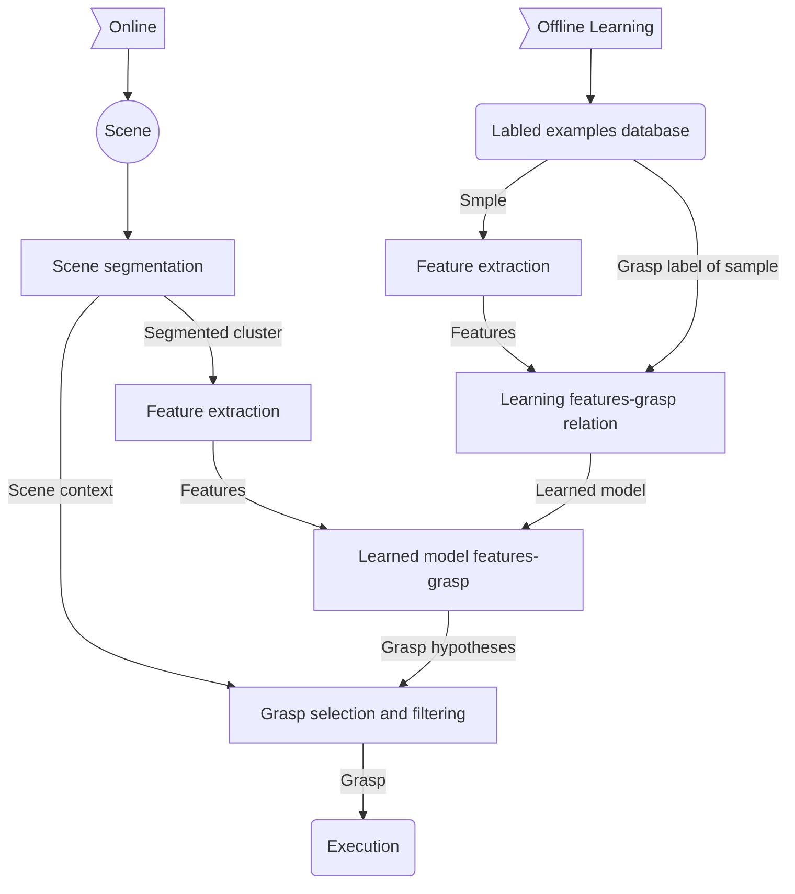

---

---

[toc]

# Grasping

## Fundamentals and definitions

### Arten of Grasp:

- Definition:
  - A system wherein a desired object is gripped by the fingers of a robot and is generally called a **grasp**

- **Precision grasp**: objects gripped by fingertips only
- **Force-closure- grasp** is a grasp which is able to:
    - generate an external force that the grasped object may have to exert on an external body and
    - counteract any external disturbing forces that may try to loosen the grip
### Grasp properties:
1. **Dexterity**: how should grasping fingers be configured?
2. **Equilibrium**: How hard to squeeze the grasped object?
3. **Stability**: How to remain unaffected by external disturbances?
4. **Dynamic behavior**: How soft a grasp should be for a given task?
[Screenshot-2019-12-30-at-12-31-48.png](https://postimg.cc/ZBq5SpSg)

### Grasp analysis and grasp synthesis
- **Analysis** means the study of grasp properties for a given set of finger properties
- **Synthesis** means the determination of the required finger properties  in order for the grasp to acquire some desired properties
[Screenshot-2019-12-30-at-12-44-13.png](https://postimg.cc/wtgG3k3W)

### Grasp contacts
In the situation of point contact
- **Frictionless point contact**: Finger can only exert a force along the common normal at the point of contact
- **Frictional point contact**: A contact that can transmit both a normal and tangential force
- **Soft contact**: Allows the finger to exert a pure torsional moment about the common normal at the point of contact
### grasp hypotheses

@ todo

 > **Jeannette Bohg, Antonio Morales, Tamim Asfour, Danica Kragic, Data-Driven Grasp Synthesis - A Survey. IEEE Tran. on Robotics, pp. 289-309, vol. 30, no. 2, 2014**
 >
 > - Aspects that influence the generation of grasp hypotheses
 >  - Prior object knowledge
 >     - known
 >     - unknown
 >     - familiar
 >   - Object-grasp representations
 >     - local
 >     - global
 >   - object features
 >     - multi-modal
 >     - 3D
 >     - 2D
 >   - Grasp synthesis
 >     - analysis
 >     - data-driven
 >   - Task
 >   - Hand kinematics
 >     - gripper
 >     - multi-fingered
 > - Classification of the different approaches
 >   - Prior knowledge
 >     - know object 
 >       - use various grasp planning methods
 >     - familiar object
 >       - reuse grasp knowledge from known class members for new object
 >     - unknown object
 >       - multi sensor fusion, pushing the object

### Object classes 
- **Known objects**(Grasp planning is always about known objects)
    - Known object geometry (we have a complete geometric object model)
    - Approach: Use various grasp planning methods(only for known objects)
- **Familiar objects**: 
    - Class of object is known
    - Approach: reuse grasp knowledge from known class members for new object
- **Unknown objects**
    - no knowledge of the object
    - Challenges: Dealing with incomplete sensor data, segmentation from the background, building a (partial) object model
    - Ideas: Multi sensor fusion, pushing the object

## The Human Hand
- [**Bones and joints**](https://en.wikipedia.org/wiki/Phalanx_bone#/media/File:Scheme_human_hand_bones-en.svg)
- **Anatomy** : 27 bones -- 27 DoF(total)
- **models**:
    - Cobos / Miller / Du and Charbon / Kuch and Huang / Pollard and Zordan / Stenger models
    - **MMM model**: 
        - Kinematics: 23 DoF
        - Anthropometric data: Anatomically correct finger segment lengths depend on total hand length

### Human Hand models in literature

- Always trade-off between intended use and complexity

## Grasping in Humans
### Neuroscience of grasping
- [ ] TODO

> Umberto Castiello. The neuroscience of grasping, Nature Rev. Neurosci. 5, 726-736(2005)
>
> This review examines one of these actions -- grasping

- Precision and Power grips
  - Precision grasp: characterized by opposition of the thumb to one or more of the other fingers.
  - Power grasp: the fingers are flexed to form a clamp against the palm

- Supposition
  
  - intended activity determines what type of grasp is used for any given action	
  
- Goal :

  Integrate information from various domains to ascertain which neural circuits underlie grasping

- Paper contributions:
  - Kinematics of grasping in human and macaque monkeys
  - Evidence that grasping requires several neural mechanisms, some of which are concerned with individual finger force and movement, and others that involve a specialized visuomotor system that encodes object features and generates the corresponding hand configurations
  - Evidence from lesion and neuroimaging studies in humans is compared with neurophysiological studies in monkeys

### Kinematics of grasping

- kinematics consider 
  - movement in terms of position
  - displacement (angular and linear) of body segments
  - center of gravity
  - acceleration and velocities of the whole body or segments of the body.

> Jeannerod, M. in Attention and Performance IX (eds Long, J. & Baddeley, A.) 153–168 (Erlbaum, Hillsdale, 1981). This paper was the first to characterize kinematically the reach-to-grasp movement in humans. This seminal work laid the foundation of much of our current understanding of grasping. Jeannerod, M. The timing of natural prehension movements. J. Mot. Behav. 16, 235–254 (1984).

- Jeannerod coded grasping in terms of changes in grip aperture
  - Definition: grip aperture is the separation between the thumb and the index finger
  - During the a reach-to-grasp movement
    1. a progressive opening of the grip with straightening of the fingers
    2. followed by a gradual closure of the grip until it matches the object's size
- The point in time at which the thumb-finger opening is the largest (maximum grip aperture) is a clearly identifiable landmark that
    - occurs with 60-70% of the duration of the reach and is highly correlated with the size of the object
    - is highly correlated with the size of the object
  
- grasping progress

  1. The hand preshapes during its journey to the target object.

  2. maximal grip aperture (distance between the tip of the thumb and the tip of index finger) typically occurs within 70% of the movement completion. 

  3. Representation of traces demonstrating the scaling of maximum grip aperture with respect to object size.

- Comparision of the kinematics of grasping in monkeys and humans: effect of size

  - Grip size in a macaque monkey and a human subject. In both species, the grasping  component is characterized by a grip size that  increases up to a maximum and then decreases towards the end of the movement. The macaque data are presented **in absolute time**, whereas those for the human participants are presented in **normalized time**, as a percentage of movement duration. 

### Neurophysiology of grasping

- Three specific areas relating to grasping
  - the primary motor cortex (`F1`)
  - the premotor cortex (`PML/F5`)
  - the anterior intrapartietal sulcus (`AIP`)

- Performing a successful grasping action depends primarily on the integrity of the primary motor cortex (`F1`)

### Neural circuits for grasping in monkeys and humans 

- Plenty of  evidences show that, grasping circuit involving several areas in the monkey brain, but don't know if there is a similar circuit exits in humans 
- For ethical reasons, we can't test it in normal human. So the most studies come from the patients with brain damage and neuroimaging experiments.

### The neuropsychology of grasping 

- in reach-to-grasp experiment, the finger grip aperture of patients with brain damage (optic ataxia) was abnormally large, and the usual correlation between maximum grip aperture and object size are missing.

### Tactile sensing in human hands

- Tactile sensing is important for all manipulation tasks

  | Afferent type (and response properties)                      | Receptive field (and probe) | Density (afferents per cm2) |
  | ------------------------------------------------------------ | --------------------------- | --------------------------- |
  | FA-I(Fast adapting type I)  - Sensitive to dynamic skin deformation of relatively high frequency - insensitive to static force - Transmit enhanced representations of local spatial discontinuities (edge-contour, Braille-like stumuli (盲文)) | Weak point touch in palm    | just in fingertips          |
  | FA-II(Fast adapting type II) - extremely sensitive to mechanical transients(瞬态) and high-frequency vibrations propagating through tissues  - Insensitive to static force   - Respond to distant events acting on hand-held objects | Light tapping               |                             |
  | SA-I (slowly-adapting type I) - sensitive to low -frequency dynamic skin deformation - sensitive to static force - Transmit enhanced representations of local spatial discontinuities | weak point touch in palm    | fingertips and fingers      |
  | SA-II (slowly-adapting type II) - Low dynamic sensitivity - Sensitive to static force  - Sense tension in dermal and subcutaneous collagenous fibre strands - can fire in the absence of externally applied stimulation and respond to remotely applied stretching of the skin | touch or skin stretch       |                             |

  

### Haptics in human grasping
~~c3 37~~
[Screenshot-2019-12-30-at-19-50-24.png](https://postimg.cc/sBJQdqsC)

`c3 38-39`

- @to do 

  - **reach phase**: 
    - object is approached
    - hand in grasping pre-shape
    - control based on vision
    - finger makes contact
      - tactile: high frequency vibrations
  - **load phase**:
    - fingers are closed
    - tangential load force is increased
    - grip force is adjusted accordingly to prevent finger slip
    - object breaks contact with support surface
      - tactile: high frequency vibrations
  - **lift phase**:
    - grip force is controlled to prevent slip
    - object if lifted from the surface
    - object has reached desired height
      - visual
  - **replace phase**:
  - humans use feed forward control to predict sensory input 
  - When prediction mismatches actual input corrective actions are taken
## Grasping Taxonomies
### purposes
- Benchmark to test robot hand abilities
- Simplify grasp synthesis
- Inspire hand design
- Optimization of synergies: Formulation of dexterity/functionality as number of achievable grasps for maximization
- guide autonomous grasp selection
### Arten
- Cutkosky Taxonomy

  [[2020-01-09-13-27-49.png](https://i.postimg.cc/283WMpQR/2020-01-09-13-27-49.png)](https://postimg.cc/jL0CnF3Z)

- Kamakura Taxonomy
  - the taxonomy considers 
  1. purpose of a grasp
  2. hand shape
  3. contact points with objects
  - Category:
	- Power Grips
	  - Power Grip-Standard Type
	  - Power Grip-hook Type
	  - Power Grip-Index Extension Type
	  - Power Grip-Extension Type
	  - Power Grip-Distal Type
  - Mid-Power-Precision Grips
    - Lateral Grip
    - Tripod Grip-Standard Type
    - Tripod Grip-Variation I
    - Tripod Grip-Variation II
  - Precision Grips
    - Parallel Mild Flexion Grip
    - Circular Mild Flexion Grip
    - Tip Grip
    - Parallel Extension Grip
  -  Thumbless 
    - Adduction Grip      
`c3 46 - 53`
- **Bullock Taxonomy**: 
	- Contact:
		- Hand is touching an external object or the environment 
	- Prehensile
		- Action of hand on object must be described with more than one virtual finger 
	- Motion
		- Any part of the hand moves relative to body fixed frame 
	- Within Hand
		- Points on the hand are moving relative to the hand base frame 
	- Motion at acontact  
		- Object reference frame moves relative to contact point frames. 
`c3 53` 
@ todo

  

> Bullock, I.M.; Ma, R.R.; Dollar, A.M., "A Hand-Centric Classification of Human and Robot Dexterous Manipulation," IEEE Transactions on Haptics, 6(2):129-144, 2013
### Whole-body poses & Duality of grasping
@ to do 
- Selection of support pose -- Grasp selection
- Selection of contact points -- Grasp synthesis
- Classification of support pose possibilities -- Grasping taxonomies
> T. Asfour, J. Borràs, C. Mandery, P. Kaiser, E. E. Aksoy  and  M.  Grotz  , On  the  Advanced  dualities  between  grasping  and  whole  -  body loco  -  manipulation  tasks  , Robotics Research, Springer  Proceedings  in  Robotics, Springer,  2018

> J  .  Borràs  and T. Asfour, A  Whole  -  Body Pose  Taxonomy  for  Loco  -  Manipulation Tasks, IEEE/  RSJ  International Conference on  Intelligent Robots and Systems (  IROS  ), pp. 1578  -  1585,  October  , 2015
- Duality of grasping and balancing
- Whole body poses in loco manipulation tasks
	- Given: humanoid, task and scene and its affordances:
		- How many poses can be realized?
		- Which pose should be selected?
		- How to realize it ? palnning, control  
- Towards a taxonomy of whole body support poses
	- Criteria for classification:
		-  number of contacs: relevant for balance conditions/ control
		-  type of contacts: determine the mobility (DOFs) and the transmission of contact forces
		- possible transitions: We only allow one contact change at time 
- Type of contacts
	- Type of contact with arms:
		- tips
		- fingers
		- palm
		- arm
		- hold
	- type of contacts with legs
		-  tip-toes
		- feet
		- knees 
- Taxonomy of whole body poses
   - total: 46 classes 
   - 18 standing poses
   - 18 kneeling poses
   - 10 resting poses
- Classification of whole body actions
	- Type I: Actions to change the envrionment
	- Type II: Actions to change the body 
	- Type III: Combination of I and II
- Validation of the taxonomy
- Analysis of pose transitions
- benefits:
   - Generate whole body multi-contact pose sequences
   - Novel statistical approach for planning multi contact motions based on the taxonomy knowledge extracted from observing human motions
   - Representation of motions as a sequence of poses(stance planning)
- Statistical modelling of pose @todo `c3 77-78`
   - **n-gram model**: probabilities of pose transitions
   - Linguistic approach
- Language model to generate multi-contact motions @todo `c3 79`
Motion (sentence) as sequences of poses (words)
### Postural Synergies 
- Definition: Postrual synergies are the correlation of degrees of freedom in patterns of more frequent use.
@todo 
> Marco  Santello  , Martha Flanders, John F.  Soechting  .  Postural Hand Synergies for  Tool Use  , The Journal of Neuroscience, 18(23): 10105  -  10115 (1998)
>  - Human were asked to perform grasp 57 kinds of objects with imaging
>  - Result:
>     	- Considering only the first two principal components, 80% of the variance in the data can be represented.
>         	- Using the first threee principal components, 97% of the variance can be represented
>  - This suggests a significant reduction in the number of degrees of freedom (DOF) from 15 to 2 or 3
>  - The study shows also that there were also many instances in which pairs of joint angles were only poorly correlated, suggesting that there are more than two effective degrees of freedom for the control of hand posture and that several higher-orer PCs would also be needed to represent this rather limited co-variation in joint angles
>  - There are two alternative solutions to this paradoxical result:
>     - higher-order PCs are needed but represent noise (random variability) in the system
>     - the higher-order PCs do in fact contribute to discriminating among hand shapes for different objects → additional DoF controlled by the CNS
> - Role of higher order PC
>   - Determine how much the representative information increased as the number of PCs increased
>     - if the higher-order PCs represent noise, the information about the object should not increase (may actually decrease) when higher-order PCs are used to define the hand posture
>     - Conversely, if the higher-order PCs do contribute to discriminating among hand shapes, the information transmitted should increase as more PCs are included
>     - The amount of information continued to increase monotonically up to at least the 5th or the 6th PC, even though these higher-order PCs contributed little to the variance
>     - clearly, more than two degrees of freedom are used to mold the hand into the shape appropriate to grasp a particular object, and **the higher-order PCs do not simply represent random variability (noise)**
>   - Given that the higher-order PCs do not simply represent noise, it is possible that the hand postures associated with a few of the objects might be the best represented by higher PCs
>     - Hence, higher PCs do not seem to contribute substantially to any one particular hand posture
>     - These features were also found in other subjects
>   - This observation suggests the following interpretation
>     - The control of hand shape is effected at two levels:
>       - One coarse control of hand shape with a few synergies, and a finer level that may be affecting all the joints.
>       - a finer level that may be affecting all the joints
>     - This hypothesis is consistent with the observation that a disproportionate amount of sensorimotor cortical area is devoted to the hand. It is also consistent with previous demonstrations of a tendency for coordinated motion of the fingers.
> - Conclution
>   - no straightforward relation : **object shape - hand shape**
>     - Similar object shapes were often associated with grips that were quite distinct (i.e., precision vs power grips)
>   - Relationship between static hand posture (i.e., kinematics) - control of contact force
>     - They are not independent, because the hand must be shaped properly so that the correct set of fingers makes contact with the object.
>     - But there is no one-to-one between posture and force control
>   - This is consistent with observations of neural activity in the hand area of primary motor cortex:
>     - Monkeys controlling the grasp force of variously shaped objects showed that **1) the neural correlates of force and 2) the neural correlates of kinematics are dissociated**  
>

> Antonio  Bicchi  , Marco Gabiccini, Marco  Santello  .  Modelling natural and artificial  hands with synergies  3153  -  3161 (2011)
>  - How do humans grasp? Do they control all the hand’s DoF individually?
> 	- Not all finger joints are controlled independently when grasping an object
> 	- Movements of the finger joints are strongly correlated
> 	- Grasping movements are dominated by synergies in a low - dimensional posture space 
> c3
> - Problem with the synergistic model so far
>   - Using previous synergy, it will penetrate the object
>     - Contact forces of the object not considered
>     - No compliance in the hand
> - Soft synergy Model
>   - Redundancy in the apparatus(human hands), together with its nonlinear elastic characteristic is used for changing the compliance of the agonist-antagonist pairs.
>   - Question: How can a model of elasticity be introduced into the synergy model?
>   - Answer: Use a combination of two force fields to control the physical hand.
>     - One field is attracting the physical hand towards a virtual hand (which is shaped on the synergy manifold). The attractions forces are generated by the hand impedance
>     - The other field is repelling the hand from penetrating the object
>   - Question 2: 
>     - Is the soft synergy model relevant to grasping? 
>     - Can the first few synergies (which were observed to generate a large part of pregrasp postures)  also explains the distribution patterns for grasp forces?
>   - Answer:
>     - Yes, Application of the soft synergy model also allows making predictions on force distributions in manipulation
>   - Experiment 
>     - Associate each postural synergy through a numerical model of hand and object compliance to a contact force pattern
### Eigengrasps
@todo
> Matei Ciocarlie, Corey Goldfeder, Peter Allen. Dimensionality reduction for hand-independent dexterous robotic grasping, IEEE/RSJ International Conference on Intelligent Robots and Systems (IROS), (2007)
>
> - coined the term "eigengrasps"
>
> - Problem of grasp planning:
>
>   - need known object, but known object always limited
>   - can treated as optimization problem:
>   - solving 27 dof problem:
>     - 6 dof space
>     - 21 hand dof
>
> - Idea of eingengrasps:
>
>   - Use 2 synergies instead of 21 Dof of hand 
>   - 27 dof reduced to 8
>
> - further thoughts (drawbacks):
>
>   - 2 synergies not necessary lead to hand configurations 
>     - This is in line with the findings that the higher synergies are not simply noise but do in fact represent detail of the objects' shape
>     - **Solution**: 
>       - After a fixed amount of interations, stop the optimization process and close the finger joints until contact to the object prevent further motion
>
>   - The algorithm does not work well with non-convex objects

### Implementation of Synergies in Robotics
@todo
> Christopher Y. Brown and Harry Asada. Inter-Finger Coordination and Postural Synergies in Robot Hands via Mechanical Implementation of Principal Components Analysis, IEEE/RSJ International Conference on Intelligent Robots and Systems (IROS), (2007)
>
> - Principal components analysis (PCA) lets us rewrite the posture matrix as the product of two smaller matrics:
>   - one matrix consisting of the principal components vectors 
>   - one matrix consisting of the weights for those vectors
> - Goal: find a way to realize this equation through mechanical means
> - 具体部分还是看计算题部分。

> c3
### The TUAT/Karlsruhe Humanoid Underactuated Hand

@todo
> Naoki Fukaya, Tamim Asfour  ,  Rüdiger Dillmann  and Shigeki Toyama,  Development of a Five  -  Finger Dexterous Hand without Feedback control: the  TUAT  Intelligent Robots and Systems  /Karlsruhe Humanoid Hand  ,  IEEE/RSJ International Conference on  (  IROS  2013)

> Weiner, P., Starke, J., Hundhausen, F., Beil, J. and Asfour, T.,  The KIT Prosthetic  Hand: Design and Control  , IEEE/RSJ International Conference on Intelligent  Robots and Systems (IROS), pp. 3328  -  3334, October, 2018

> c3

#### Underactuation

**Underactuation** expresses the property of a system to have an input vector of smaller dimension than the output vector

- In robotic, it means having fewer actuators then degrees of freedoms(DoF)
  - Simple control
  - Adapt to the shape of the object
  - Mechanical intelligence

- core idea/benifit:
  - Light weight, similar size, similar motion
  - only one actuator
  - No need for sensors, simple operation
  - Self-make a best gripping shape
  - Self adjustment of fingertip force
  - No need for feedback control

- Motivation: Typical grasp motion of daily life 

  (cylinderical grasp, tip, hook or snap, palmer, spherical, lateral)

- Latest version(2013)
  
- `c3 136` + `Development of a Five-F Dexterous Hand without Feedback control:`
  
- The KIT prosthetic hand 
Personalised prosthetic hands with semi-autonomous grasping abilities
  - The KIT Prosthetic Hand: Design and Control
  - ~~male and female prosthetic hands c3 s145~~
  - ~~Hand Design~~

## Grasping Known, Familiar and Unknown Objects

### 1. Grasping Known Objects
[Screenshot-2020-01-02-at-10-45-06.png](https://postimg.cc/1nyvpQhw)

#### Segmentation methods
- **Shape primitives**: Manual segmentation into primitives
- **Box decomposition**: Automatic segmentation into boxes
- **Superquadrics**: Automatic segmentation into superquadrics
- **Medial axis transformation**:use only spheres
- **Surface normals**
### 2. Grasping familiar/similar objects
#### 2.1 Concept
- Identify categories of objects with **common characteristics/features**
   - visual: texture, shape, spatial constellation
   - semantic: Functionality, affordances, task
- Train grasps on a set of **known objects**
   - store features and generated grasps(feature-grasp relations)
   - use learning mechanisms for generalization
- grasp new but familiar/similar objects
  - Categorize the new object
  - recall grasp hypothesis of objects in the same category
  - adapt grasp hypothesis to new object
#### 2.2 Discriminative approaches
- learn a discriminative function to separate positives(good) and negatives(bad) grasps
- use low-level 2D and/or 3D features
[Screenshot-2020-01-02-at-11-42-20.png](https://postimg.cc/6TVyj42d)

##### Example from Rao et al.
- goal: learn which parts of the scene are **graspable** or not
- segmentation based on depth information
#### 2.3 Grasp synthesis by comparison
- find the most similar object in the database
- adapt good grasps for that object
##### Synthetic exemplars:
- Requirement: 3D object models(for exemplary and familiar objects)
- Use 3D models to calculate similarity
- Transfer grasp to familiar/similar object
###### Example from Li and Pollard
- Grasp synthesis as a **shape matching** problem
- Hand pose database:
   - **Contact points and normals**
   - On hand and known object
##### Sensor-based exemplars:
[Screenshot-2020-01-02-at-18-17-47.png](https://postimg.cc/SX4ZTTk8)
- Use object representation from sensor data
- Execute on real robot
- Learn from past and new grasp experiences
###### Example from Herzog et al.
- Training data:
   - Programming by [demonstration](https://postimg.cc/gr51qbtB "Screenshot-2020-01-02-at-18-34-05.png")
   - generate templates from **demonstrated grasps**
- Template
   - is **Local shape descriptor** for a possible grasp pose
   - generated from 3D depth data
- Matching
   - find **best matching template** according to the local shape
#### 2.4 Generative models for grasp synthesis
- distinguish positives and negatives grasps
- abstract **over all examples in the database**
###### Example from Song et al.
[Screenshot-2020-01-02-at-19-02-41.png](https://postimg.cc/nMqsKp03)
- Infer grasp configuration for an object given a **specific task**
- Joint distribution of variables is modelled as [**Bayesian network**](https://towardsdatascience.com/introduction-to-bayesian-networks-81031eeed94e)
#### 2.5 Category-based grasp synthesis
- Idea: use object categories and semantic to determine similarity (previous approaches use similar low-level features)
   - similarity on **semantic level**
   - different shape or appearance
   - same functional category (but can be grasped in a similar way)
- Category is not known
   - Category needs to be determined
   - Classification of objects based on features
###### Example from Madry et al.
- classification based on multi-model visual descriptors
- also uses task information
- Bayesian network generates hand configuration
#### 2.6 Part-Based Grasp Planning for Familiar Objects
- goal
   - **Generalized grasping information** for familiar objects
   - Grasps can be used for familiar objects and **partly known objects**
- Offline learning
   - **Train** grasps on multiple familiar object models
   - Identify promising grasps with **transferability success measure**
   - Steps:
      - Object shape segmentation
      - Labeling with task-related information
      - part-based grasp planning
- Online
   - **Transfer** grasps to similar novel objects
   - Steps:
      - localization and approximation of object parts
      - grasp transfer to novel object
[Screenshot-2020-01-02-at-19-39-30.png](https://postimg.cc/D8gWWhcR)
### 3. Grasping Unknown Objects
#### 3.1 Concept
- unknown objects(difficulty):
   - Object model is not available
   - No access to similar objects or grasp experiences
- Mapping: Noisy sensor data -> Candiate grasps
- Approaches can be divided into two methods
[Screenshot-2020-01-02-at-20-16-34.png](https://postimg.cc/HrMGLwXx)
   - Approximating unknown object shape
   - from low-level features to grasp hypotheses
- idea
   - Approximate object shape using shape primitives
   - plan grasp on approximated shape  
- ~~input options~~
#### 3.2 Approximation
- Shape approximation methods
  -  Quadrics
  - local normal estimation
  - mesh construction(using symmetry)
##### 3.2.1 using Quadrics: Dunes et al.
 - idea: Find a quadric that approximates at best the shape of the object
 - features: object minor axis, its centroid position and its rough size
 - use of active vision:
    - gather multiple views of the object 
    - minimize uncertainty of parameters
    - determine the next best view
##### 3.2.2 on point clouds: Marton et al.(local normal estimation)
- input :Point cloud
- steps: 
    - initial step: Estimation of **surface normal** and **minimal curve radius** for each point from **one single view**
    - different Surface estimation methods are tested:
        - fit boxes and cylinders
        - detect revolution surfaces
        - triangulate free form surfaces
     - Grasp planning on estimated object surface
##### 3.2.3 Using Symmetry
###### Detecting and Shape Completion Using Symmetry from Bohg et al.  
- detect planar reflection symmetry in point cloud
     - each point P can be uniquely associated with a second point Q by reflection on the opposite side of a **symmetry plane**
     - iteratively improve and test hypothesis for symmetry plane
- object shape completion
   - create a mesh based on original and mirrored points
   - use **poisson reconstruction** to create a mesh
- plan grasps on the completed object shape
###### Shape completion: Schiebener et al.
- idea
   - use planar reflection symmetry
      - still holes in the point cloud
      - additional completion steps
   - sides of the object
      - projection into the camera plane
      - subdivide image into horizontal segments
      - find minimal and maximal point in horizontal direction
      - connect with mirrored points
   - bottom of the object
      - use supporting plane
- Finding symmetry planes
   - proposed approach: symmetry assumption plus information about scene context
      - estimate possible support surfaces based on neighbour points around the segmented object
      - search for best symmetry plane perpendicular to these support surfaces
   - generate symmetry plane candidates
      - mirror object points on them
      - rate them based on visibility criteria
   - mirrored points may
     - coincide with the original points
     - lie behind the original points
     - lie in front of the object
     - lie besides the object
- Object shape completion
   - completed point cloud results from:
      - Mirroring at the symmetry plane(green)
      - regular samples in intersection of estimated support plane and bottom part of the object(light blue)
      - along edges: Straight lines from the front to the back side in the depth direction(dark blue)
      - [Screenshot-2020-01-03-at-18-34-29.png](https://postimg.cc/HcS01HGQ)
- Shape completion results 
  - completed shape allows grasp planning, but inaccuracies must be expected and handled
#### 3.3 Low Level Features
##### Process
- step1: Vision/Image processing
    - Edge detection
    - Surface detection
- step 2: Abstract elements extraction
   - Edge based
   - Surface based
- step 3: Geometry analysis for grasping
   - Edge based
   - Surface based
##### Early Cognitive Vision(ECV) based Elementary Grasping Action(EGA)
- Hierarchical ECV system (step1)
[Screenshot-2020-01-03-at-19-01-31.png](https://postimg.cc/dhJnTJRK)
- Edge Elementary Grasping Action(eEGA)
   - Extract abstract contours (step2)
   - Generate edge based grasping action (step3)
[Screenshot-2020-01-03-at-19-05-05.png](https://postimg.cc/Fks3HK5P)
- Surface Elementary Grasping Actions (sEGA)
   - contact points extraction (step2)
   - [Screenshot-2020-01-03-at-19-11-23.png](https://postimg.cc/fSmyZnkH)
- Surface Elementary Grasping Actions
   - Contact points extraction (step2)
   - Contact points selection (step3)
   - [Screenshot-2020-01-03-at-19-11-33.png](https://postimg.cc/KKW8MvMq)
##### Graspable Boundary and Convex Segments
- Grasplet
[Screenshot-2020-01-03-at-19-38-03.png](https://postimg.cc/nMM9LrXD)
   - Graspable boundary segment: A segment that corresponds to a 3D spatial discontinuity
   - Graspable convex segment: A segment along which the angle between the two faces forming the segment is greater(or smaller ??? ) that 180 deg
- Contour segments(step1)
[Screenshot-2020-01-03-at-19-40-40.png](https://postimg.cc/PC5Bgg3T)
- Grasplets extraction(step2)
[Screenshot-2020-01-03-at-19-40-40.png](https://postimg.cc/PC5Bgg3T)
#### 3.4 Deep Learning for grasping
##### 3.4.1Training Data
Every learning approach depends on the training data
- sources of data
   - Learning by demonstration
   - Training data collection on  the target system
   - Training data generation in simulation
   - Hand-labeled data
   - ~~details c3 s222~~
##### 3.4.2 Deep learning approaches
- Learning by demonstration
- Grasp hypothesis generation and scoring
   - Generation of datasets in simulation
   - hand-labeled datasets
   - **generative, discriminative, heat maps**
- Sim2real
   - reinforcement learning
   - domain randomization
   - domain adaptation, generative adversarial models
- Learning on the target system
   - reinforcement learning
###### Grasp hypothesis generation and scoring
- general
   - the starting point for the learning is a dataset
   - each entry in the dataset consists of a 
      - Camera image ( RGB or RGBD) or point cloud
      - Hand pose
      - Hand configuration
      - Tactile information(sometimes)
      - Grasp score
   - [Screenshot-2020-01-03-at-20-25-56.png](https://postimg.cc/1V5GR18r)
- generative approach
generative approaches are straight forward when it comes to deep learning for grasping
   -idea/ approach
   [Screenshot-2020-01-03-at-20-31-01.png](https://postimg.cc/SnXwQw84)
      - no pre/post processing
      - directly feed camera image into the network and predict the best grasp
   - common network architecture
   [Screenshot-2020-01-03-at-20-31-10.png](https://postimg.cc/ZWyMz6tK)
      - convolutional layers, followed by some fully connected layers 
   -  ~~Example from Schmidt et al. : c3 226-239~~
- discriminative approach
discriminative approaches rate a grasp hypothesis according to sensor data
   - Idea/approach
   [Screenshot-2020-01-03-at-20-40-50.png](https://postimg.cc/FkVJLWLs)
      - neural network estimates the quality of a grasp based on incomplete information(Training data has to contain positive and negative training samples)
      - assumption: Network will learn to internally complete the missing information
      - common network architecture
      [Screenshot-2020-01-03-at-20-42-12.png](https://postimg.cc/7fQSMRRf)
      -  ~~Example from Schmidt et al. : c3 241~~
      - @todo c3 242
- heat maps
Heat map based approaches map images to images
   - Idea/Approach
   [Screenshot-2020-01-03-at-20-54-26.png](https://postimg.cc/0KCjXzZ8)
      - for each pixel in the input image rate the grasp quality
      - use image to image techniques from computer vision
      - select pixel with highest predicted grasp score for execution
   - common network architecture
   [Screenshot-2020-01-03-at-20-54-26.png](https://postimg.cc/0KCjXzZ8)
   - Example 
   @todo c3 244-246
