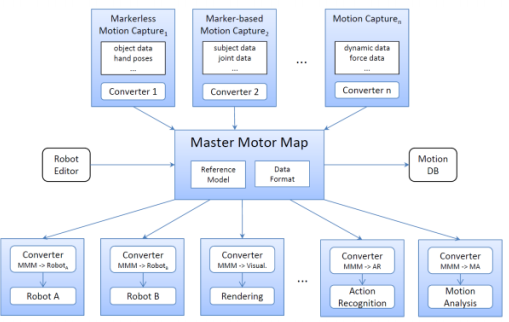

[TOC]

**Anthropomatics** is the science of the symbioses between human and machine

## Why humanoids?  - [x] -

- Versatility 

  - we need robots which are: versatile, i.e. can perform a wide variety of tasks
  - can act and interact in made-for-human environments
  - can use made for human robots

- Better Prediction of robot actions

  - motion behaviour of robots with human-like morphology, i.e. humanoid robots, allows humans to better predict the robot actions. This leads to intuitive and fluent human-robot interaction 

- Acceptance

  - human-like appearance may support and intuitive human-robot interaction but Uncanny Valley tells us something different!

## Uncanny Valley:

- The uncanny valley is the region of negative emotional response towards robots that seems 'almost' human. Movement amplifies the emotional response

- Building Humanoids = Building Human-Centred Technologies 

  

## Contact Detection and grasp verification

### Contact Detection using joint torques

- Compute weighted sum of finger joint torques
- Contact is detected where a threshold is surpassed.

### Object grasped successfully?

- Calculate distances:
  - between different  fingertips (for precision grasps)
  - between different fingertips and the palm (for power grasps)

## Detection of Deformability

###  Deformable objects can be detected:

- Grasp an object
- Verify that the grasp was successful
- Increase the joint torques
- Determine distances between the fingertips
  - Decreased distances indicate a deformable object

## The Master Motor Map(MMM) - [x] -

**Unifying framework** for capturing, representation, visualization and whole body human motion and mapping/converting to different embodiments

#### Goal - [x] -

- offer an unified representation of bodies models to design humanoid robots
- Reference model of the human body
  - for humanoid robot design
  - Imitation of human actions
  - Action recognition
  - Visualization of human movements
- *Interfaces and data structures* for the *transfer of motor knowledge* between different embodiments

#### Description of the three main models in human body reference in MMM - [x] -

- **Kinematic model**: joints and segment lengths
- **Dynamic model**: 
  - segment mass 
  - center of mass
  - moments of inertia
- **Statistic/anthropomorphic model**: Segment properties defined as a function of global parameters

#### Motion reproduction using MMM:

- Data from stereo based markerless human motion capture system
- Data from VICON system(SFB 588)

#### How to use MMM - [x] -

Replacement of any module(perception, recognition, visualization, reproduction) can be guaranteed by using the MMM as the exchange format

 - All perceptive modules convert their output to the MMM format
 - All recognition and reproduction modules convert the MMM format to their specific internal representation