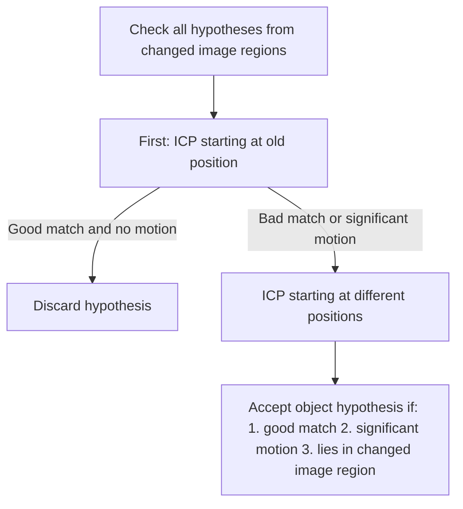

[TOC] 

# Active Perception

- definitions
  - ~~definition1 c4 s8~~
  - ~~definition2 c4 s8~~
  - definition3: An agent is an active perceiver if it knows **why** it wishes to sense, and then chooses **what** to perceive, and determines **how**, **when** and **where** to achieve that perception.

### five questions - [x] -
[Screenshot-2020-01-04-at-20-50-17.png](https://postimg.cc/Yh5yy8DJ)

 - **Why**
   the current state of the agent determines **what its next actions might be** , **based on the expectations that its state generates**. These are termed Expectation-Action tuples. This would rely on any form of inductive inference because inductive reasoning takes specific information and makes a broader generalization that is considered probable. The only way to know is to test the conclusion. A fixed, pre-specified, control loop is not within this definition.
   
 - **What**
   Each expectation applies to a specific subset of the world that can be sensed and any subsequent action would be executed within that field. We may call this Scene Selection
   
   what is perceived? the robot autonomously selects which section the scene he perceives.
   
 - **How**
   A variety of actions must precede the execution of a sensing or perceiving action
   
   - **Mechanical Alignment**: The agent must be placed appropriately within the sensory field
   - **Sensor alignment**: The sensing geometry must be set to enable the best sensing action for the agent's expectations( including components internal to a sensor such as focus, light levels, etc.)
   - **Priming**: Finally, the agent's perception mechanism must be adapted to be most receptive for interpretation of sensing results, both specific to current agent expectations as well as more general world knowledge
   
   how is perception achieved? the robot selects orientation from sensors, the body or the type of perception and interpretation
   
 - **When**
   An agent expectation requires **Temporal Selection**, that is, each expectation has a temporal component that prescribes when is it valid and with what duration 
   
   when is something perceived? the robot choose point in time (now, in the Future) and the duration of perception
   
 - **Where**
   The sensory elements of each expectation can only be sensed from a particular viewpoint and its determination is modality specific. (For example, how an agent determines a viewpoint for a visual scene differs from how it does so for a tactile surface.) The specifics of the sensor and the geometry of its interaction with its domain combine to accomplish this. This will be termed the Viewpoint Selection process.
   
   where is something perceived? the robot chooses its pose in the room (Agent pose) as well as the pose of the sensors used to determine the location of Determine perception 

- Classical CV vs. Active Vision vs. Active Perception

|                               | Classical CV | Active Vision | Active Perception |
| ----------------------------- | ------------ | ------------- | ----------------- |
| Image processing              | ja           | ja            | ja                |
| Viewpoint selection           | -            | ja            | ja                |
| **Multi-modal sensory input** | -            | -             | ja                |
| Changing agent's state        | -            | ja            | ja                |
| **Changing the environment**  | -            | -             | ja                |

- (Inter-)active Perception
  - forceful interaction with the environment
    creates a novel sensory signal
  - Exploit the regularity in S x A x t
    - S: Multi-model sensory input
    - A: Executed action
    - t: Time
  - Benefits
    - Generation of new sensory input
    - Using the regularity in S x A x t to predict, update world state
    - Prior knowledge makes interpretation easier
    - Learn the regularity S x A x t
  - Perception modes:
    - **Vision**
    - Audio
    - **Tactile**, force, pressure
    - Laser, infrared, sonar, ...
    - Internal state(temperature, force, voltage,...)
    - ...

## Active Visual Perception

### main idea - [x] -

- use robot's action to make visual perception better
- segment object with interaction: create hypotheses and validate

### steps - [x] -

- create initial object hypotheses

- Interaction with hypotheses: push action

- hypotheses relocate and determine transformation

-  Verify and improve hypothesis 

  

### Why visual perception? - [x] -

- Recognition (of known objects)
- Localization (determine spatial relationship between objects, and between the robot and the environment)
  get an internal representation of the world state for planning and acting
- Observation (of motion, actions, relations over time)
  Learn: trajectories, possible actions, probabilities of events...
- **Discovery** (of new things)
  Learn: visual appearance of new, unknown objects

- Discovery and learning of unknown objects)
  - goal: Learn the visual appearance of an unknown object for future recognition
  - steps:
    - discover the new object
    - segment it from the background
    - learn its visual appearance for recognition
    - ~~c4 21 22~~
      [Screenshot-2020-01-05-at-18-57-48.png](https://postimg.cc/67PbynPQ)

### Create initial object hypotheses

- Generate initial object hypotheses based on camera images

#### Three heuristics - [x] -

- planes, cylinders and spheres amongst SIFT(RANSAC) features(Scale-Invariant Feature Transform)
  --> textured objects
- Unicoloured regions of promising size(colour MSERs(Maximally stable extremal regions)) 
  --> single-coloured objects
- Visually salient regions(DoG filter)
  --> objects that are neither textured nor unicoloured

- general 
  - Generate hypotheses using all three heuristics
  - dense stereo matching to get 3D position of all pixels of the image
  - Each hypothesis is represented by the set of RGBD points in its image region
  - Hypothesis selection for verification by pushing
    - filter out those which are lower than their local neighbourhood
    - select reachable hypothesis
    - c4 s27-29
- Object pushing
  - pushing
    move the object sufficiently for segmentation, but:
    - keep object in field of view
    - do not change visual appearance too much
    - push object over a fixed distance towards a central point in front of the robot
      [Screenshot-2020-01-06-at-19-05-36.png](https://postimg.cc/QVqjXqFj)
  - minimize risk of collisions with other objects
    - approach the object from the top
    - move the hand down beside the object, then push it
     - raise the hand, move it back out of sight
  - detect collisions using force-torque sensor in the wrist 
  - adapt approaching path reactively

### Re-localize, determine transformation

#### motion estimation

- after pushing: Re-localize object hypotheses
  - use point cloud matching to re-localize object and estimate motion
  - textured objects: match SIFT features (Scale-Invariant Feature Transform)
- object hypotheses represented by sets of RGBD points
- for each hypothesis: estimate motion
  - if it didn't move, ignore it
  - if it moved, osbjectness verified
- verified object: Segment it to learn a visual object descriptor

[Screenshot-2020-01-06-at-19-31-37.png](https://postimg.cc/VdKgc5nK)

- "good match" = small mean cartesian+colour distance of RGBD point correspondences
- ICP finds a local optimum
  --> initiate it in different regions with colour histogram similar to hypothesis

##### ICP

Iterative Closest Point for matching, using a distance in cartesian and colour space

- match two point clouds **A** and **B** using ICP:
  1. for each **a** ∈ **A** find closest point in **B**
  2. Calculate transformation **T** that minimizes the mean squared distance of the correspondences
  3. Apply **T** to all **a** ∈ **A**
- Iterate until convergence
- Problems:
  - find small object in complex scene
  - object only partially covered, false points included
  - 3D shapes ambiguous, e.g. many planes in most scenes
- use weighted cartesian+colour distance in step 1 of ICP
  - removes most shape ambiguities
  - gives more reliable point correspondences

### Verify and improve hypothesis 

#### Hypothesis correction and extension

- discard points that
  - don't accord with the overall motion 
    i.e. the point from the initial hypothesis has no good position+colour match in the new point cloud after the transformation of the whole object has been applied to it
  - come to lie in an unchanged image region
- add new candidate points that lie in a changed image region close to the hypothesis
- improve hypothesis over several pushes
  - push the object 2-3 time
    -->complete segmentation
  - more pushes reveal different sides
    --> generate a multi-view descriptor
[@paper](D. Schiebener , A. Ude and T. Asfour, Physical Interaction for Segmentation of Unknown Textured and Non - textured Rigid Objects , IEEE International Conference on Robotics and Automation (ICRA), 2014)
### related work

~~c4 s61-67~~

## Active Haptic Perception = Haptic Exploration

- Motivation
  - Haptically explore unknown objects
  - Hints for classification, recognition and manipulation
- Human senses
  - Touch(Somatic)
  - Sight(Vision)
  - Hearing(Audition)
  - Smell(Olfaction)
  - Taste(Gustation)

### What is Haptic - [x] -

- the sense of touch
- Any form of nonverbal communication involving touch
- ~~c4 s73~~

### Haptic perception - [x] - 

- important questions in haptic perception
  - Haptic sensor technologies
  - Object shape estimation based on collected sparse haptic data
  - Application, e.g. grasping unknown objects

#### Haptics = tactile + Proprioception - [x] -

- Tactile / Cutaneous:
  - temperature, pressure, vibration, slip, pain
  - Sensation arising from stimulus to the skin
- Proprioception / kinesthesia:
  - Limb position/location, motion, force
  - End organs located in muscles, tendons, and joints
  - Stimulated by body movement

#### Haptic exploration can only be active

- six manual "exploratory procedures" and their associated object properties
  [Screenshot-2020-01-06-at-20-46-58.png](https://postimg.cc/wRQCzJdW)
   - lateral motion(texture)
   - unsupported holding(weight)
   - pressure(hardness)
   - enclosure(global shape)(volume)
   - static contact(temperature)
   - contour following(global shape)(exact shape)

### Haptic exploration
- haptic exploration can only be active
- six manual "exploratory procedures" and their associated object properties
  - Lateral Motion / Texture
  - Pressure / Hardness
  - Static Contact / Temperature
  - Unsupported Holding / Weight
  - Encloseure / Global Shape / Volume
  - Contour Following / Global Shape / Exact Shape
- important things
  - Haptic sensor technologies
  - Object shape estimation based on collected sparse haptic data
  - Application, e.g. grasping unknown objects
  [Screenshot-2020-01-12-at-21-58-39.png](https://postimg.cc/MnnDns0H)
[@paper](Bierbaum, A., Rambow , M., Asfour, T., Dillmann, R. Grasp Affordances from Multi - Fingered Tactile Exploration using Dynamic Potential Fields. In IEEE/RAS International Conference on Humanoid Robots, 2009.)

### Potential Field Based Exploration - [x] -

#### introduction - [x] -

there's two kinds of field, attract field and repulsive field, repulsive field will make the robot hand moves away from that field, the attract file will make the robot hand move towards to that field

[@paper](Bierbaum, A., Rambow, M., Asfour, T., Dillmann, R. Grasp Affordances from Multi-Fingered Tactile Exploration using Dynamic Potential Fields. In IEEE/RAS International Conference on Humanoid Robots, 2009.)

- Method originally developed for Motion planning and Mobile robot SLAM

#### Exploration using dynamic potential fields - [x] -
- Fielder gradient direction (in operational space)
  - Unknow regions --> attractive  $\phi_a < 0$
  - Known regions --> repellent $\phi_r > 0$
- field attraction
- Dynamic adaptation of potential field configuration from tactile response
- Superposition of individual potential sources
$\ phi(x) = \sum_i phi_{r,i}(x) + \sum_j phi_{a,j}(x)$
- Field initialization from pose and extension estimation of target object, e.g. by computer vison
- Steps:
  - Generation of trajectories for multi-point end-effectors(Robot Control Points, RCPs) using real-time gradient calculation
  - Harmonic potential functions to minimize number of local minima
  - Reconfiguration strategy for resolving structural local minima of the hand
  - Real-time inverse kinematics using Virtual Model Control(VMC)
  - Result: Oriented 3D point set with irregular density 

#### Move along the surface of object - [x] -

with the sum of repulsive field of explored surface and attractive field of unexplored field, the force will make robot hand moves along the surface of object

#### deform object and undeform object  - [x] -

start from when tactile sensors detect the object and calculate the diameter of the object and distances between fingers. Add the force to object and see if the diameter of object and distances between fingers changes, if yes, the object is deform object. if not the object is not deform object

### Haptic Exploration with Movemaster

#### Extracting Grasp Hypotheses

[Screenshot-2020-01-06-at-21-20-23.png](https://postimg.cc/nCgzMjjd)

#### Geometric Filtering and Grasp Computation

- generate all face pairings and compute grasp affordance quality
- grasp affordance quality s(f~1~ , f~2~) for each face pairing from 4-stage filter pipeline
  $\ s(f_{1},f_{2})=\sum_{i=1}^{4}o_{i}(f_{1},f_{2})$
   - Parallelism
   - Minimum face size
   - Mutual visibility(intersection of projection)
   - Face distance
- Calculation of grasp parameters for highest quality grasps
  - Approach direction of TCP(Tool Center Point)
  - Hand orientation
  - Target configuration of RCPs(Robot Control Points)

#### Tactile Object Exploration

Association between objects and actions(grasps) -->Symbolic grasps(grasp affordances)

##### Steps: 

- Potential field approach to guide the robot hand along the object surface
- Oriented 3D point cloud from contact data
- extract faces form 3D point cloud in a geometric feature filter pipeline

## Combining Vision and Haptics

- Visually guided exploration on ARMAR
  - Exploration in simulation 
    - Physics extension for Open Inventor/VRML modelling of complex mechanical systems
    - modelling of virtual sensors
    - virtual Model Control(VMC) - based inverse kinematics

### Haptic Exploration for Grasping

how to maximize information gain during haptic exploration?

- Exploration procedure: Requirements
  1. Estimate object surface in a data efficient manner
     **--> Data efficient surface model => GPIS**
  2. Plan exploration actins efficiently
     **--> Maximize information gain per cost => Proposed procedure**
  3. Gather as much information per contact as possible
     **--> Maximize information gain per contact => Position & normal**

[Screenshot-2020-01-06-at-22-25-10.png](https://postimg.cc/MX81pGfb)

#### Next-Best-Touch for Tactile Exploration

[@paper](Ottenhaus, S., Kaul, L., Vahrenkamp, N. and Asfour, T., Active Tactile Exploration Based on Cost-Aware Information Gain Maximization, International Journal of Humanoid Robotics, vol. 15, no. 1, pp. 1-21, 2018)

- State-of-the-art: Gaussian process variance(GP-V)

  Maximize($\Delta$Information)

  - Maximize information
  - Ignore path cost

- Tactile exploration @ H2T
  
  Information Gain Estimation Function(IGEF)
  
  Maximize$\frac{\Delta Information}{\Delta Cost}$
  
  - Minimize **uncertainty**:Explore unknown regions
  - Minimize **path cost**:path cost in distance and rotation
  - Maximize **locality**:Prefer exploration targets that are in proximity of explored regions
  
##### Plan Exploration Actions Efficiently
| Symbol | Description |
|---|---|
|$x ; x_n$|Query position; normal|
|$r; r_n$|Current position; normal|
|$c \in C$|Set of explored points|
|$\sigma,\mu$|Scaling factors|
  - **Maximize $\Delta$ information**: Reduce uncertainty
    $$ \Psi_1(x)=\min_{c \in C}\left(1-exp\left(-\frac{||x-c||^2}{\sigma^2}\right)\right)$$
    
  - **Stay local**: Prefer targets, that are close

    $$ \Psi_2(x)=exp\left(-\frac{(||x-c||-\mu)^2}{\sigma^2}\right)$$

  - **Minimize path cost**: Minimize movement and rotation of the hand
    $$\Psi_{3,pos}(x)=\frac{1}{||Path(r,x)||}$$  $$\Psi_{3,rot}(x)=exp\left(-\frac{sin^2(\frac{1}{2}arccos(r_n\cdot x_n)}{\sigma^2}\right)$$
  - **Resulting Function**:
    IGEF: $\Psi = \Psi_1 \cdot \Psi_2 \cdot \Psi_{3,pos} \cdot \Psi_{3,rot}$

##### Summary

- difference between GP-V and IGEF
  - GP-V is greedy --> large steps
  - IGEF stays local --> smaller steps
  - [Screenshot-2020-01-06-at-22-27-36.png](https://postimg.cc/hfX4FL4C)
- Path generation using Bezier curves
- Combined goals lead to a systematic exploration of the object
- Spiral exploration pattern on a plane
- Also works for complicated surfaces
- first touch yields most information(1 touch is enough)

#### Exploration and Reconstruction of Unknown Objects using Normal and Contact Sensors

- Benefits:
  - Use IMUs and pressure sensor in order to get surface orientation in a wide range
  - Simultaneously, measure contact force
  - Allows the reconstruction of surface of unknown objects
  - Accurate for big objects and coarse surfaces

## Active Hearing

- Fundamental questions in active hearing

  - What are the spatial filtering properties of the recording system
  - How does the environment transform the signal(e.g. pulse responses)
  - Does the robot produce self-noise

- Approach using Sound source localization (modified)

  [Screenshot-2020-01-13-at-10-09-00.png](https://postimg.cc/9wfPM4zQ)

- further research topics

  - Auditory Scene analysis

    How to identify / separate different sound sources

    (Talking to other persons in a noisy room)

  - Soud Understanding

    Use knowledge of perceived signal

    (human voice, phone bell, door knocking)

  - Sound Reasoning

    Use the sound signal to reason about the enviroment of the sound source (echo)
