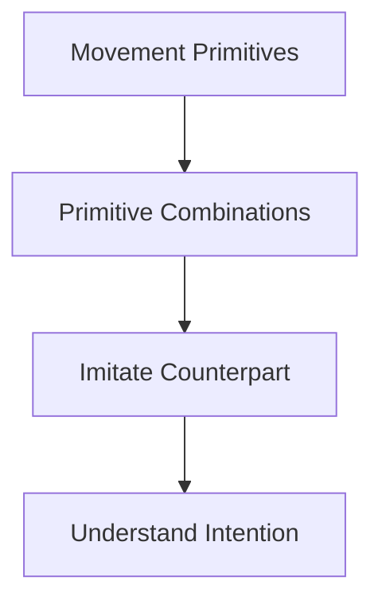
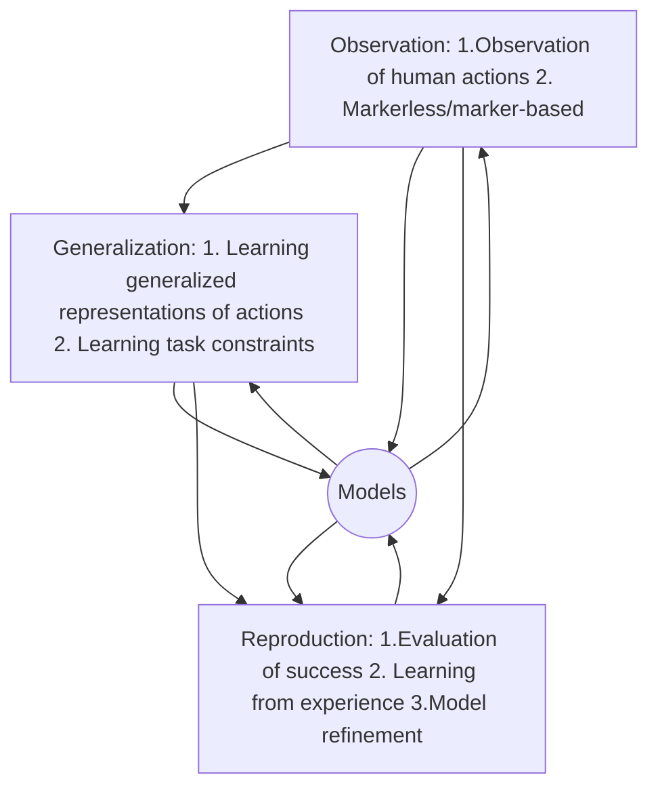
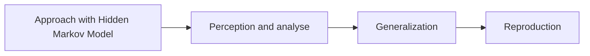

[toc]

# Imitation Learning

learning from human observation
- Imitation is an advanced behaviour whereby an individual observes and replicates another's behaviour.
## different viewpoints of Imitation learning
- Computer science 
   - Three Phases Model
   [Screenshot-2020-01-07-at-10-47-52.png](https://postimg.cc/XrTLLT4k)
     - Decomposition into subproblems
     - Solution to different problems
     - Integration of the solution
- Cognitive science
focus on "software" of brains
   - ~~c5 s6~~
   - true imitation, if 
      - the imitated behaviour is absolutely new for the imitator 
      - the same strategy is employed as that of the demonstrator
      - the same task goal is achieved
      - ~~c5 s7~~
   - from today's view, imitation is also an important expression of higher intelligence
   - Innate Releasing Mechanism(IRM)
      - Every newborn has a certain repertoire of innate movement patterns
      - Be observing others' movements, these pattern will be activated and a correspondent movement is released
      - The model is very interesting because it supports the idea of implementing a **set of pre-programmed behaviours** in a technical system(robot) to bootstrap learning by imitation
      - IRM is unlikely because
         - many movements can be imitated, which means that a large number of these movements should be pre-programmed
         - newborns are constantly trying to **improve the imitated movements** which also speaks against a firm anchorage
   - Active Intermodal Mapping(AIM) Modell: 
      - The visual perception of the teacher's movement is converted into a higher level representation that can be matched against appropriately transformed proprioceptive information about one's own movement
      - if this match space is given, imitation can be seen as **learning to achieve a target representation**, a problem can be tackled with techniques from supervised learning

- Neuroscience and Cognitive Neuroscience
Focus on "Hardware" of brains
   - Imitations-region in brains(F5)
      - Active during observation **and** movement
      - Active during **whole** observation
      --> neurones codes complete movement and concrete types of movement, not only their subsequences
      - Essential prerequisite for imitation is a **connection between the sensory systems and the motor systems** such that percepts can be mapped onto appropriate actions. This mapping is a difficult computational process as visual perception takes place in a different coordination frame to motor control
   - Connection to same neurones in F5, **the mirror neurones**, which are active both when the monkey observed a specific behaviour and when it executed itself
   - ~~c5 s15~~
## key questions of Imitation and PbD
- **whom** to imitate
   - choosing a demonstrator whose behaviour can benefit the imitator(teacher selection)
- **when** to imitate
   - the imitator has to segment and identify the beginning and end of a shown behaviour
   - the imitator has to decide if the observed behaviour is appropriate in the current context, and also how many times this the behaviour should be repeated
- **what** to imitate
   - Find out what aspects of the demonstration are of interest. 
      - In the case of **actions**, the demonstrator's **movements(trajectories)** are relevant. 
      - In other situations, the results and the **effects** of actions are considered more important
   - For a given task, certain observable or affectable properties may be **irrelevant** and safely ignored. For instance, if the demonstrator always approaches a location from the north, is it necessary for the robot to do the same?
   - In continuous control tasks, **what to imitate** relates to the problem of defining automatically the **feature space** for learning, as well the **constrains** and the **cost function**
   - In discrete control tasks, such as those treated by reinforcement learning and symbolic reasoning, what to imitate relates to the problem of how to define the **state and action space** and of how to automatically **learn the pre/post conditions** in an autonomous decision system
- **how** to imitate
   - Determine how the robot will actually perform the learned behaviours to maximize the metric found when solving the what to imitate problem. 
  (Often, a robot cannot act exactly in the same way as a human, due to differences in physical embodiment. For example, if the demonstrator uses a foot to move an object, is it acceptable for a wheeled robot to bump it, or should it use a gripper instead)
  - the robot has to learn how to imitate by **mapping perception into a sequence of motion actions related to its own body.** Therefore, embodiment of the robot and its body constraints determine how observed action can be imitated(**Correspondence Problem)**
## Meltzoff's imitation learning model
[Screenshot-2020-01-07-at-13-44-21.png](https://postimg.cc/ZCNsnFSs)  

## Terms
### Robot Programming by Demonstration(PbD)
#### Benefits
- PbD is a powerful mechanism for **reducing the complexity of search spaces for learning.** When observing either good or bad examples, one can reduce the search for a possible solution, by either starting the search from the observed search for a possible solution, by either starting the search from the observed good solution, or conversely, be eliminating the bad ones from the search space.
- PbD offers an **implicit means of training a robot**, such that explicit and tedious programming by a human user can be minimized or eliminated
- studying dan modelling the **coupling of pereption and action**, which is at the core of imitation learning, helps us to understand the mechanisms by which the self-organization of perception and action could arise during development
### Imitation Learning(IL)
Idea: Reproduction of mirror neurones by movement primitives
[Screenshot-2020-01-07-at-14-11-00.png](https://postimg.cc/Sjsr50xp)
### learning from Human Demonstration(LfD)
- Proposal for a procedure
   - Build a motion library ob observing human's action
      - Elements of motion library: **Motion Primitives**
      - Focus on goal-oriented movements, consider other constraints, such as objects and forces
      - Methods of recording human movements(Motion Capture Techniques)
   - Application of motion primitives to generate more complicated whole body movements
- key questions: Representation and adaptation of motion primitives
   - Motion alphabet, similar to natural language
   - Library of motion primitives as DMPs
   - Tasks as sequences of motion primitives
### Learning from Human Observation
[Screenshot-2020-01-07-at-14-40-26.png](https://postimg.cc/yJnfgcTM)

### Apprenticeship Learning
null
## Observation(Learning from Human Observation)
to capture and reconstruct whole-body **and** objects motions 
- Motion capture techniques
   - Marker-based systems
   - CMU, KIT
   - Markerless
      - Computer vision problem
      - new sensors
### The Master Motor Map(MMM)
**Unifying framework** for capturing, representation, visualization and whole body human motion and mapping/converting to different embodiments
#### Goal: 
- offer an unified representation of bodies models to design humanoid robots
- Reference model of the human body
  - for humanoid robot design
  - Imitation of human actions
  - Action recognition
  - Visualization of human movements
- *Interfaces and data structures* for the *transfer of motor knowledge* between different embodiments
#### Models:
- **Kinematic model**: joints and segment lengths
  - Kinematic model of the human shoulder-arm system: 
    - 9 DOF 
    - Shoulder: 5 DOF
    - Elbow: 2 DOF 
    - Wrist: 2 DOF
- **Dynamic model**: 
  - segment mass 
  - center of mass
  - moments of inertia
- **Statistic/anthropomorphic model**: Segment properties(e.g. length, mass etc.) defined as a function(regression) of global parameters(e.g. body height, weight)
#### Motion reproduction using MMM:
- Data from stereo based markerless human motion capture system
- Data from VICON system(SFB 588)
#### How to use MMM:
Replacement of any module(perception, recognition, visualization, reproduction) can be guaranteed by using the MMM as the exchange format
 - All perceptive modules convert their output to the MMM format
 - All recognition and reproduction modules convert the MMM format to their specific internal representation
### Human Motion Capture(HMC) -- markerless
- the system operates on a simplified 3D human model
- Output is a sequence of configuration vectors of this model, one for each frame
- the only input to the system is a sequence of stereo image pairs ; no markers are used
- Cues:
   - Edge cue:
   Operates on 2D image positions along the projected contour
   - Distance cue:
   Operates on 3D positions of the hands and the head
   - Basic fusion:
   - ~~details c5 s46~~
- Example: Stereo-based 3D HMC
  - Capture 3D human motion based on the image input from the camera of the robot's head **only**
  - Approach
     - Hierarchical Particle Filter framework
     - Localization of hands and head using colour segmentation and stereo triangulation
     - Fusion of 3d positions and edge information
     - Half of the particles are sampled using inverse kinematics
  - ~~Features c5 s45~~ 

~~c5 s48~~
## Generalization(Learning from Human Observation)
- **decompose the demonstration into pieces**
- representation of these pieces in a parameterizable way
- two levels of representation
  - Trajectory-level
     - Trajectory-level Encodings:
     a low-level representation of the skill, taking the form of a non-linear mapping between sensory and motor information
     [Screenshot-2020-01-08-at-11-00-11.png](https://postimg.cc/qgYPvF0H)
     - Generalization of movements
        - generic representation of motion which allows encoding of very different types of signals/gestures
        - does not allow to reproduce complicated high-level skills
        - Trajectory segmentation is needed
  - Symbolic-level:
     - Symbolic-level Encoding: 
     a high-level representation of the skill that decomposes the skill in a sequence of action-perception units
     [Screenshot-2020-01-08-at-11-00-28.png](https://postimg.cc/cvGPQ8rD)
     - Sequential organization of pre-defined elements(actions)
        - Allows to learn hierarchies
        - Requires to pre-define a set of basic controllers for reproduction
        - Task segmentation is needed
### Segmentation
- Segmentation means to **divide** a motion into **meaningful** segments, i.e. find prominent/distinctive points, **the key points**, of the demonstration
- "Meaningful" depends on the application and is subjective
  - Each step in a walking motion?
  - Segmenting between dancing and walking?
  - Repetition of an exercise?
- Input data
   - **joint angle** trajectories(mostly used)
   - **Cartesian** trajectories of virtual markers or end-effectors
   - **Semantic relations** between objects-objects and objects-demonstrator(hand)
#### Key points
Local minimum and maximum and also pauses
[Screenshot-2020-01-08-at-11-21-43.png](https://postimg.cc/8f4YmZ9N)
[Screenshot-2020-01-08-at-11-21-57.png](https://postimg.cc/PNMf7Tkr)
#### Motion Segmentation
- different algorithms
   - Zero-Velocity-Crossings
   - Based on Principle Component Analysis
   - Based on clustering
   - Based on machine learning
   - Based on object relation changes
   - Based on object relation changes & motion characteristic changes
   - ...
- Applications
   - Segmentation into exercise repetition
   (rehabilitation progress evaluation)
   - Segmentation into single manipulation action
   (extraction of actions contained in a demonstration)
   - Segmentation into single activities
   (waling, dancing, running)
##### Zero Velocity Crossings(ZVCs)
- ZVC: Direction change results in zero velocity
- Assumes that some significant movement occurs between ZVCs
- Algorithm:
   - Label all ZVCs
   - Apply segmentation rules
- **Segment if** 
   - the movement is significant (M)
   - and at least two joints have a ZVC within T seconds
- Features:
   - Simple, easy to implement
   - No model required
   - Online capable
- Restrictions:
   - Tends to ***under-segment***
   - Dose not find segment with smooth transitions
   - Only tested for an arm with 4 DoFs in the paper
   - Unable to segment a whole class of specific movements
   - Doesn't consider co-articulation at all
   - threshold parameters: M, T
   - Impractical for whole-body motion
   - Segmentation not complete
##### Principal Component Analysis(PCA)
- Input: Sequence of 56-dim. Vectors
- **Assumption**: simple motions exhibit lower dimensionality than more complex motions
- Error function **e**(reproduction error after PCA)
- Algorithm
   - Use **k frames** and PCA to identify dimensionality r
   - Observe derivative d~i~ = e~i~ - e~i-l~ with **l** large enough to compensate noise
   - Move sliding window
- Segment if d~i~ is more than three standard deviations from average
- Features
   - High accuracy
   - No model required
- Restrictions
   - Parameters: k, l, ...
   - Sliding window (delay-accuracy-tradeoff)
   - Motion must be longer than k + l frames
   - only tested for hight-level motions
   - Tend to ***over-segment*** for complex motions
##### Segmentation Point Classification
- Many different approaches from ML are tested and combined
- Data points are divided into two categories:
   - A segmentation point(p~1~)
   - Not a segment point(p~0~)
- Many p~0~ and few p~1~ => resampling for balance
- Data points are then stacked to provide temporal information

[Screenshot-2020-01-08-at-14-07-32.png](https://postimg.cc/wRL4ghdS)
- approaches tested:
   - Dimensionality reduction: PCA and FDA(Fisher's Discriminate Analysis)
   --> Not much difference between PCA and FDA
   - Classifiers: k-Nearest Neighbours, radial basis function, SVM + Kernel trick, Neural Network
   --> SVM seems to be sufficient, no NN needed
   - Aggregators: None, Boosting, Bagging
   --> Aggregators have little influence

[Screenshot-2020-01-08-at-14-12-53.png](https://postimg.cc/xcWxqpdB)

- Features
Able to classify segment points of unknown primitives
- Restrictions
  - Learning needs to be done offline
  - Some overfitting can be observed
### Action representation
#### Dynamical Systems: Dynamic movement primitives(DMP)
- Trajectory formulation using canonical systems of differential equations
- Parameters are estimated using locally weighted regression
#### Spline-based representation
- fifth order splines that correspond to minimum jerk trajectories to encode the trajectories
- Time normalize the example trajectories
- Determine common knot points so that all example trajectories are properly approximated. Similar to via-point, key-points calculation.
  
#### Stochastic: Hidden Markov Models(HMM)
- HMMs are first order Markov chains, i.e. the subsequent state depends exclusively on the current state
- States are not observable but we can observe the output they generate. (Therefore "hidden")
[Screenshot-2020-01-08-at-14-47-06.png](https://postimg.cc/Xpm11frK)
   - example: In speech sounds are known; syllables are hidden
- suitable for the classification of **time series data**, such as speech or gestures signals
##### One HMM contains:
- States **S~i~**
- Transition probabilities a~ij~
- Start probabilities π~ij~
- Observation probabilities b~i~ for each state S~i~
   - Discrete
   - Continuous
      - Probability density with mean µ~i~ und covariance matrix U~i~
##### Basic Algorithms
- Forward-Algorithm:
Given an observation sequence O = O~1~ ,..., O~n~ and a model λ
How to efficiently compute P(O| λ), the probability of the observation sequence, given the model?
- Viterbi-Algorithm:
Given an observation sequence O = O~1~ ,..., O~n~ and a model λ
How to find a corresponding state sequence S = S~1~ , ... ,S~n~ which is optimal in some sense
- Baum-Welch-Algorithm:
      -How to adjust the model parameters λ(**training of the HMM**) to maximize P(O|λ)

##### Approach

(Model-based Imitation of arm movements)

[@paper](T. Asfour et al. (2006, 2008). Imitation Learning of Dual-Arm Manipulation Tasks in Humanoid Robots. International Journal on Humanoid Robots, 2008. (International Conference on Humanoid Robots, 2006))

- steps:
   - Imitation learning process based on multiple demonstrations
   - HMM **for recognition and reproduction** of the motion
      - Both joint angles as well as positions and orientations of the hand are recorded and three different HMMs are trained
      - Depending on the priority ~~- imitation of the exact TCP trajectory or, if possible, arm positions -~~ the influence of the respective HMM on the reproduction can be controlled by a set of weighting factors
   - Analysis of trajectories for characteristic point("**key points**")
   - Reproduction on the kinematic model of Humans'
      - Model of a human arm with 9 DOF
##### Training HMMs
[Screenshot-2020-01-08-at-15-18-39.png](https://postimg.cc/vgxp3Gyh)
##### Reproduction with HMM
HMM is trained by multiple demonstrations
- Continuous HMM: Output probabilities are calculated from probability densities of normal distribution
- After the training, mean values of these distributions can be calculated to form an "average" trajectory
- generalization/ Reproduction
[Screenshot-2020-01-08-at-16-30-23.png](https://postimg.cc/N9hDTz89)
   - Interpolation between common key points(separately for Positions-, Orientations- und Joint Values -CKP)
   - Subsequently, inverse kinematics, from position and orientation to joint angle
   - Reproduction:
   [Screenshot-2020-01-08-at-16-30-23.png](https://postimg.cc/N9hDTz89)
###### Key points
- Key points are prominent/distinctive points of a movement(such as: Local minimum and maximum and also pauses)
- Purpose to determine these points:
   - Data reduction(important for HMM)
   - Movement is represented exclusively by characteristic points --> Better comparability of trajectories
[Screenshot-2020-01-08-at-11-21-43.png](https://postimg.cc/8f4YmZ9N)
[Screenshot-2020-01-08-at-11-21-57.png](https://postimg.cc/PNMf7Tkr)
###### Common Key Points
Which state should be considered for the reproduction: Common Key Points
- Similar key points from the various demonstrations are **common key points** C~i~ = (k~1~, ... , k~D~)
- Relevant to a generalized movement: Key Points that occur in (almost) all demonstrations
- How to find:
   - Usually used for such problems: Dynamic Programming Matching(Dynamic-Time-Warping, DTW)
   - Alternative: HMM
      - Viterbi algorithm provides optimal state sequences for the key-point sequences of the various demonstration
      - Common key points are obtained from states that occur in all sequences
[Screenshot-2020-01-08-at-16-26-20.png](https://postimg.cc/9wbDmDFX)
###### Temporal Coordination
- Motivation: sometimes temporal relations need to be taken into account, such as Pouring(with two arms)
- In the case of several demonstrations, the common key points can be used:
   - For each common key point C~i~(k~1~ , ... , k~D~), a vector of time stamps of the individual key points can be specified:(τ~1~, ..., τ~D~)
   - Common key point C~i~ of the right arm must be reached before common key point C~j~ of the left arm, if we have(k is the number of the demonstrations):
   $$ \forall k:(\tau_{i}^{k} < \tau_{j}^{k}) $$
##### Reproduction: The Kinematic Model
- Early version of MMM
- Features:
   - Each arm has 9 DOFs
   - Model directly calculated + inverse Kinematic
   - Rotation is represented by Euler-Angle or RPY-Angle
   - Implemented in MCA
   - Visualization with Openlnventor
##### Soechting-Angle
Sensorimotor transformation model for human-like arm positions 
- Motivation: Joint angles were not present, which are necessary for the approach
- Calculation of Soechting-Angle:
[Screenshot-2020-01-08-at-19-23-42.png](https://postimg.cc/Wh4FnPHH)
- ~~get angles from the soechting angles c5 s93-94~~
- ~~Experiment c5 s95-98~~

##### What can / Should we learn?
- Classic motor learning: learn the control policies
   - Example: Learning desired trajectories with HMMs
      - representation by a sequence of key points
      - can be used for action recognition
      - can be used for action reproduction
   - Limitations:
      - the current method considers only the movement information
      - Do not directly relate to the goal states of an action
      - No feedback control possible
- At a "more cognitive level"
   - learn the goal states of an action
   - learn about the state of the environment, for example preconditions that need to be fulfilled to execute the action primitives
- the learning could be done for example by gathering the statistics about the state of the environment before and after the action execution
- goals
   - long term goal
      - not a dancing robot
      - a learning robot
      - Interaction with objects
    - Perfect imitation
       - absolutely same relation **R** to an object
       - similar arm posture

##### Incorporating the goals in the reproduction

HMMs are nice because they account both the reproduction and classification, but we need to account also for the goals of an action and other types of control than feed-forward control 
- Adaptation of movements to the given situation
- Interpolation between movements in a motion library
- Idea: Adaptation of movements to the given situation
[Screenshot-2020-01-08-at-20-10-07.png](https://postimg.cc/nMFX1QRk)
   - Low-level imitation: Parameters only at start and end points
   - Learn relative path
   - Reproduction with respect to changed world
   - Limitation: Only small changes can be captured

##### From perception to reproduction with HMM
~~[Screenshot-2020-01-08-at-19-29-21.png](https://postimg.cc/XXfch3xN)~~
[Screenshot-2020-01-08-at-17-13-23.png](https://postimg.cc/30JTpTv9)

---
### Task Segmentation  on Object Hand Relations(Hierarchical Segmentation)

#### Capturing of the human demonstration
- Human motion capturing with VICON
- The agent and all objects have several **markers** attached
- All markers are **labeled** and **grouped** by the attached object
- Extraction of marker trajectories

#### Action Segmentation

##### Idea
  - Use **contact/non-contact relations** to segment the action, i.e. to et important key frames out of object interactions
  - Cartesian distance of markers employed to **detect contact and key frames**
  - Resulting in segmentation of an action sequence into several **action primitives**(unlabelled)
     - Example: "Preparing a dough" is divided into grasping, pouring, placing etc.
  - **Object relations** support the extraction of **general pre/postconditions** of an action primitive(such as: LeftHand touches RedCup)
##### ~~World state and pre/postconditions~~

##### Detection contact between hand and object
vision--> difficult ; haptics-->require contact sensors
   - Mapping of marker representation into geometric model representation
      - 3D mesh model for all objects with virtual markers
      - Registration or recorded markers with virtual markers for 6D pose estimation
      - 6D trajectories analysed by mesh collision detection algorithms

##### Marker-based Motion Capture to 6D Object Trajectories
   - Recordings of **action sequences** with marker-based motion capture
   - Conversion to **6D object pose trajectories** with simplified MMM models
   - **Input** for segmentation algorithm

##### Hierarchical Action Segmentation
extension of previous semantic segmentation
   - motivation: Semantic segmentation provides relevant information about key frames but ***actions without observable effects cannot be detected***
   - Segmentation of human demonstration on two levels
      [Screenshot-2020-01-08-at-21-04-49.png](https://postimg.cc/bZDmy9MY)
      - Semantic segmentation based on object relation changes(top level)
         - Extraction of contact relation changes between hand-objects and object-object using 3D mesh models and Simox collision detection algorithms
      - Motion segmentation based on trajectory characteristics(bottom level)
         - Segmenting of semantic segments into **most distinctive parts** based on the motion characteristic
         - New **heuristic** based on **acceleration profile** to segment motion
         - Iterative search for best key frame in current semantic segment
         - Recursive segmentation until segments **too small** or **too similar**
         - details: Motion Characteristics Heuristic
               [Screenshot-2020-01-08-at-21-07-16.png](https://postimg.cc/Wh2R1C6N)
               ***[Screenshot-2020-01-08-at-21-12-45.png](https://postimg.cc/DSGzKmrJ)***
   - Evaluation of segmentation results
      - new metric: Mean squared error with penalties for missing and additional key frames$$ e = (m+f)*p+\sum_i min_j(k_{r,i} - k_{f,j})^2$$
      m: missed key frames
      f: false positives
      p: penalty
      -~~others c5 s121~~ 
##### Evaluating Motion Segmentation Algorithms
   - **Open source framework to evaluate motion segmentation algorithms**
   - Novel way to assess the quality of the segmentation of human motion recordings, called the **Integrated Kernel** approach
   - the **Motion Segmentation Point Hierarchy** to discriminate different granularities on which motion segmentation algorithms operate
   - Includes labelled datasets and algorithms from the literature
##### ~~Others c5 s125-140~~
---