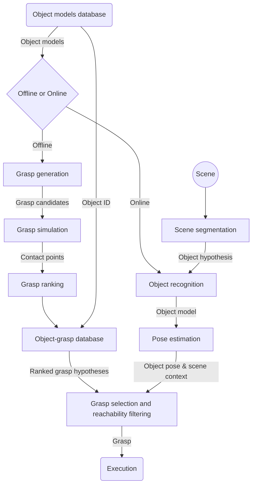
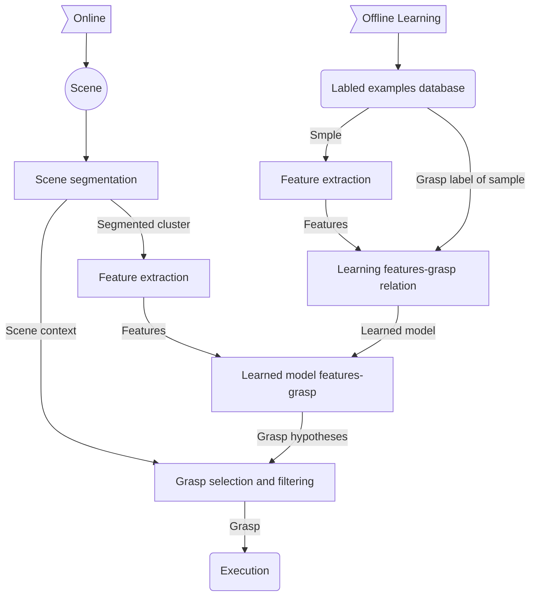

# Grasping
## Arten of Grasp:
A system wherein a desired object is gripped by the fingers of a robot and is generally called a **grasp**
- **Precision grasp**: objects gripped by fingertips only
- **Force-closure- grasp** is a grasp which is able to:
    - generate an external force that the grasped object may have to exert on an external body and
    - counteract any external disturbing forces that may try to loosen the grip
## Grasp properties:
1. **Dexterity**: how should grasping fingers be configured?
2. **Equilibrium**: How hard to squeeze the grasped object?
3. **Stability**: How to remain unaffected by external disturbances?
4. **Dynamic behaviour**:How soft a grasp should be for a given task?
[Screenshot-2019-12-30-at-12-31-48.png](https://postimg.cc/ZBq5SpSg)

## Grasp analysis and grasp synthesis
- **Analysis** means the study of grasp properties for a given set of finger properties
- **Synthesis** means the determination of the required finger properties  in order for the grasp to acquire some desired properties
[Screenshot-2019-12-30-at-12-44-13.png](https://postimg.cc/wtgG3k3W)

## Grasp contacts
for point contact
- **Frictionless point contact**: Finger can only exert a force along the common normal at the point of contact
- **Frictional point contact**: A contact that can transmit both a normal and tangential force
- **Soft contact**: Allows the finger to exert a pure torsional moment about the common normal at the point of contact
---
## grasp hypotheses
@ todo
 > **Jeannette Bohg, Antonio Morales, Tamim Asfour, Danica Kragic, Data-Driven Grasp Synthesis - A Survey. IEEE Tran. on Robotics, pp. 289-309, vol. 30, no. 2, 2014**

---
## Object classes 
- **Known objects**(Grasp planning is always about known objects)
    - Known object geometry(we have a complete geometric object model)
    - Approach: Use various grasp planning methods(only for known objects)
- **Familiar objects**: 
    - Class of object is known
    - Approach: reuse grasp knowledge from known class members for new object
- **Unknown objects**
    - no knowledge of the object
    - Challenges: Dealing with incomplete sensor data, segmentation from the background, building a (partial) object model
    - Ideas: Multi sensor fusion, pushing the object
## The Human Hand
- [**Bones and joints**](https://en.wikipedia.org/wiki/Phalanx_bone#/media/File:Scheme_human_hand_bones-en.svg)
- **Anatomy** : 27 bones -- 27 DoF(total)
- **models**:
    - Cobos / Miller / Du and Charbon / Kuch and Huang / Pollard and Zordan / Stenger models
    - **MMM model**: 
        - Kinematics: 23 DoF
        - Anthropometric data: Anatomically correct finger segment lengths depend on total hand length
## Grasping in Humans
### Arten: 
supposition: the intended activity determines what type of grasp is used for any given action
- **Precision grasp**: characterized by opposition of the thumb to one or more of the other fingers
- **Power grasp**: the fingers are flexed to form a clamp against the palm
### the kinematics & neuropsychology of grasping
@todo
> Umberto Castiello. The neuroscience of grasping, Nature Rev. Neurosci. 5, 726-736(2005)
### Haptics in human grasping
~~c3 37~~
[Screenshot-2019-12-30-at-19-50-24.png](https://postimg.cc/sBJQdqsC)
- **reach phase**: @to do `c3 38-39`
- **load phase**:
- **lift phase**:
- **replace phase**:
## Grasping Taxonomies
### purposes
- Benchmark to test robot hand abilities
- Simplify grasp synthesis
- Inspire hand design
- Optimization of synergies: Formulation of dexterity/functionality as number of achievable grasps for maximization
- guide autonomous grasp selection
### Arten
- Cutkosky / Kamakura Taxonomy
- **Bullock Taxonomy**: 
@ todo
> Bullock, I.M.; Ma, R.R.; Dollar, A.M., "A Hand-Centric Classification of Human and Robot Dexterous Manipulation," IEEE Transactions on Haptics, 6(2):129-144, 2013
### Whole-body poses & Duality of grasping
@ to do 
> T. Asfour, J. Borràs, C. Mandery, P. Kaiser, E. E. Aksoy  and  M.  Grotz  , On  the  Advanced  dualities  between  grasping  and  whole  -  body loco  -  manipulation  tasks  , Robotics Research, Springer  Proceedings  in  Robotics, Springer,  2018

> J  .  Borràs  and T. Asfour, A  Whole  -  Body Pose  Taxonomy  for  Loco  -  Manipulation Tasks, IEEE/  RSJ  International Conference on  Intelligent Robots and Systems (  IROS  ), pp. 1578  -  1585,  October  , 2015
- Duality of grasping and balancing
- Whole body poses in loco manipulation tasks
- Towards a taxonomy of whole body support poses
- Type of contacts
- Taxonomy of whole body poses
   - total: 46 classes 
- Classification of whole body actions
- Validation of the taxonomy
- Analysis of pose transitions
- benefits:
   - Generate whole body multi-contact pose sequences
   - Novel statistical approach for planning multi contact motions based on the taxonomy knowledge extracted from observing human motions
   - Representation of motions as a sequence of poses(stance planning)
- Statistical modelling of pose @todo `c3 77-78`
   - **n-gram model**: probabilities of pose transitions
   - Linguistic approach
- Language model to generate multi-contact motions @todo `c3 79`
Motion (sentence) as sequences of poses (words)
### Postural Synergies 
@todo 
> Marco  Santello  , Martha Flanders, John F.  Soechting  .  Postural Hand Synergies for  Tool Use  , The Journal of Neuroscience, 18(23): 10105  -  10115 (1998)

> Antonio  Bicchi  , Marco Gabiccini, Marco  Santello  .  Modelling natural and artificial  hands with synergies  3153  -  3161 (2011)

> c3
### Eigengrasps
@todo
> Matei Ciocarlie, Corey Goldfeder, Peter Allen. Dimensionality reduction for hand-independent dexterous robotic grasping, IEEE/RSJ International Conference on Intelligent Robots and Systems (IROS), (2007)

> c3
### Implementation of Synergies in Robotics
@todo
> Christopher Y. Brown and Harry Asada. Inter-Finger Coordination and Postural Synergies in Robot Hands via Mechanical Implementation of Principal Components Analysis, IEEE/RSJ International Conference on Intelligent Robots and Systems (IROS), (2007)

> c3
### The TUAT/Karlsruhe Humanoid Hand
@todo
> Naoki Fukaya, Tamim Asfour  ,  Rüdiger Dillmann  and Shigeki Toyama,  Development of a Five  -  Finger Dexterous Hand without Feedback control: the  TUAT  Intelligent Robots and Systems  /Karlsruhe Humanoid Hand  ,  IEEE/RSJ International Conference on  (  IROS  2013)

> Weiner, P., Starke, J., Hundhausen, F., Beil, J. and Asfour, T.,  The KIT Prosthetic  Hand: Design and Control  , IEEE/RSJ International Conference on Intelligent  Robots and Systems (IROS), pp. 3328  -  3334, October, 2018

> c3
## Grasping Known, Familiar and Unknown Objects
### 1. Grasping Known Objects
[Screenshot-2020-01-02-at-10-45-06.png](https://postimg.cc/1nyvpQhw)

#### Segmentation methods
- **Shape primitives**: Manual segmentation into primitives
- **Box decomposition**: Automatic segmentation into boxes
- **Superquadrics**: Automatic segmentation into superquadrics
- **Medial axis transformation**:use only spheres
- **Surface normals**
### 2. Grasping familiar/similar objects
#### 2.1 Concept
- Identify categories of objects with **common characteristics/features**
   - visual: texture, shape, spatial constellation
   - semantic: Functionality, affordances, task
- Train grasps on a set of **known objects**
   - store features and generated grasps(feature-grasp relations)
   - use learning mechanisms for generalization
- grasp new but familiar/similar objects
  - Categorize the new object
  - recall grasp hypothesis of objects in the same category
  - adapt grasp hypothesis to new object
#### 2.2 Discriminative approaches
- learn a discriminative function to separate positives(good) and negatives(bad) grasps
- use low-level 2D and/or 3D features
[Screenshot-2020-01-02-at-11-42-20.png](https://postimg.cc/6TVyj42d)

##### Example from Rao et al.
- goal: learn which parts of the scene are **graspable** or not
- segmentation based on depth information
#### 2.3 Grasp synthesis by comparison
- find the most similar object in the database
- adapt good grasps for that object
##### Synthetic exemplars:
- Requirement: 3D object models(for exemplary and familiar objects)
- Use 3D models to calculate similarity
- Transfer grasp to familiar/similar object
###### Example from Li and Pollard
- Grasp synthesis as a **shape matching** problem
- Hand pose database:
   - **Contact points and normals**
   - On hand and known object
##### Sensor-based exemplars:
[Screenshot-2020-01-02-at-18-17-47.png](https://postimg.cc/SX4ZTTk8)
- Use object representation from sensor data
- Execute on real robot
- Learn from past and new grasp experiences
###### Example from Herzog et al.
- Training data:
   - Programming by [demonstration](https://postimg.cc/gr51qbtB "Screenshot-2020-01-02-at-18-34-05.png")
   - generate templates from **demonstrated grasps**
- Template
   - is **Local shape descriptor** for a possible grasp pose
   - generated from 3D depth data
- Matching
   - find **best matching template** according to the local shape
#### 2.4 Generative models for grasp synthesis
- distinguish positives and negatives grasps
- abstract **over all examples in the database**
###### Example from Song et al.
[Screenshot-2020-01-02-at-19-02-41.png](https://postimg.cc/nMqsKp03)
- Infer grasp configuration for an object given a **specific task**
- Joint distribution of variables is modelled as [**Bayesian network**](https://towardsdatascience.com/introduction-to-bayesian-networks-81031eeed94e)
#### 2.5 Category-based grasp synthesis
- Idea: use object categories and semantic to determine similarity (previous approaches use similar low-level features)
   - similarity on **semantic level**
   - different shape or appearance
   - same functional category (but can be grasped in a similar way)
- Category is not known
   - Category needs to be determined
   - Classification of objects based on features
###### Example from Madry et al.
- classification based on multi-model visual descriptors
- also uses task information
- Bayesian network generates hand configuration
#### 2.6 Part-Based Grasp Planning for Familiar Objects
- goal
   - **Generalized grasping information** for familiar objects
   - Grasps can be used for familiar objects and **partly known objects**
- Offline learning
   - **Train** grasps on multiple familiar object models
   - Identify promising grasps with **transferability success measure**
   - Steps:
      - Object shape segmentation
      - Labeling with task-related information
      - part-based grasp planning
- Online
   - **Transfer** grasps to similar novel objects
   - Steps:
      - localization and approximation of object parts
      - grasp transfer to novel object
[Screenshot-2020-01-02-at-19-39-30.png](https://postimg.cc/D8gWWhcR)
### 3. Grasping Unknown Objects
#### 3.1 Concept
- unknown objects(difficulty):
   - Object model is not available
   - No access to similar objects or grasp experiences
- Mapping: Noisy sensor data -> Candiate grasps
- Approaches can be divided into two methods
[Screenshot-2020-01-02-at-20-16-34.png](https://postimg.cc/HrMGLwXx)
   - Approximating unknown object shape
   - from low-level features to grasp hypotheses
- idea
   - Approximate object shape using shape primitives
   - plan grasp on approximated shape  
- ~~input options~~
#### 3.2 Approximation
- Shape approximation methods
  -  Quadrics
  - local normal estimation
  - mesh construction(using symmetry)
##### 3.2.1 using Quadrics: Dunes et al.
 - idea: Find a quadric that approximates at best the shape of the object
 - features: object minor axis, its centroid position and its rough size
 - use of active vision:
    - gather multiple views of the object 
    - minimize uncertainty of parameters
    - determine the next best view
##### 3.2.2 on point clouds: Marton et al.(local normal estimation)
- input :Point cloud
- steps: 
    - initial step: Estimation of **surface normal** and **minimal curve radius** for each point from **one single view**
    - different Surface estimation methods are tested:
        - fit boxes and cylinders
        - detect revolution surfaces
        - triangulate free form surfaces
     - Grasp planning on estimated object surface
##### 3.2.3 Using Symmetry
###### Detecting and Shape Completion Using Symmetry from Bohg et al.  
- detect planar reflection symmetry in point cloud
     - each point P can be uniquely associated with a second point Q by reflection on the opposite side of a **symmetry plane**
     - iteratively improve and test hypothesis for symmetry plane
- object shape completion
   - create a mesh based on original and mirrored points
   - use **poisson reconstruction** to create a mesh
- plan grasps on the completed object shape
###### Shape completion: Schiebener et al.
- idea
   - use planar reflection symmetry
      - still holes in the point cloud
      - additional completion steps
   - sides of the object
      - projection into the camera plane
      - subdivide image into horizontal segments
      - find minimal and maximal point in horizontal direction
      - connect with mirrored points
   - bottom of the object
      - use supporting plane
- Finding symmetry planes
   - proposed approach: symmetry assumption plus information about scene context
      - estimate possible support surfaces based on neighbour points around the segmented object
      - search for best symmetry plane perpendicular to these support surfaces
   - generate symmetry plane candidates
      - mirror object points on them
      - rate them based on visibility criteria
   - mirrored points may
     - coincide with the original points
     - lie behind the original points
     - lie in front of the object
     - lie besides the object
- Object shape completion
   - completed point cloud results from:
      - Mirroring at the symmetry plane(green)
      - regular samples in intersection of estimated support plane and bottom part of the object(light blue)
      - along edges: Straight lines from the front to the back side in the depth direction(dark blue)
      - [Screenshot-2020-01-03-at-18-34-29.png](https://postimg.cc/HcS01HGQ)
- Shape completion results 
  - completed shape allows grasp planning, but inaccuracies must be expected and handled
#### 3.3 Low Level Features
##### Process
- step1: Vision/Image processing
    - Edge detection
    - Surface detection
- step 2: Abstract elements extraction
   - Edge based
   - Surface based
- step 3: Geometry analysis for grasping
   - Edge based
   - Surface based
##### Early Cognitive Vision(ECV) based Elementary Grasping Action(EGA)
- Hierarchical ECV system (step1)
[Screenshot-2020-01-03-at-19-01-31.png](https://postimg.cc/dhJnTJRK)
- Edge Elementary Grasping Action(eEGA)
   - Extract abstract contours (step2)
   - Generate edge based grasping action (step3)
[Screenshot-2020-01-03-at-19-05-05.png](https://postimg.cc/Fks3HK5P)
- Surface Elementary Grasping Actions (sEGA)
   - contact points extraction (step2)
   - [Screenshot-2020-01-03-at-19-11-23.png](https://postimg.cc/fSmyZnkH)
- Surface Elementary Grasping Actions
   - Contact points extraction (step2)
   - Contact points selection (step3)
   - [Screenshot-2020-01-03-at-19-11-33.png](https://postimg.cc/KKW8MvMq)
##### Graspable Boundary and Convex Segments
- Grasplet
[Screenshot-2020-01-03-at-19-38-03.png](https://postimg.cc/nMM9LrXD)
   - Graspable boundary segment: A segment that corresponds to a 3D spatial discontinuity
   - Graspable convex segment: A segment along which the angle between the two faces forming the segment is greater(or smaller ??? ) that 180 deg
- Contour segments(step1)
[Screenshot-2020-01-03-at-19-40-40.png](https://postimg.cc/PC5Bgg3T)
- Grasplets extraction(step2)
[Screenshot-2020-01-03-at-19-40-40.png](https://postimg.cc/PC5Bgg3T)
#### 3.4 Deep Learning for grasping
##### 3.4.1Training Data
Every learning approach depends on the training data
- sources of data
   - Learning by demonstration
   - Training data collection on  the target system
   - Training data generation in simulation
   - Hand-labeled data
   - ~~details c3 s222~~
##### 3.4.2 Deep learning approaches
- Learning by demonstration
- Grasp hypothesis generation and scoring
   - Generation of datasets in simulation
   - hand-labeled datasets
   - **generative, discriminative, heat maps**
- Sim2real
   - reinforcement learning
   - domain randomization
   - domain adaptation, generative adversarial models
- Learning on the target system
   - reinforcement learning
###### Grasp hypothesis generation and scoring
- general
   - the starting point for the learning is a dataset
   - each entry in the dataset consists of a 
      - Camera image ( RGB or RGBD) or point cloud
      - Hand pose
      - Hand configuration
      - Tactile information(sometimes)
      - Grasp score
   - [Screenshot-2020-01-03-at-20-25-56.png](https://postimg.cc/1V5GR18r)
- generative approach
generative approaches are straight forward when it comes to deep learning for grasping
   -idea/ approach
   [Screenshot-2020-01-03-at-20-31-01.png](https://postimg.cc/SnXwQw84)
      - no pre/post processing
      - directly feed camera image into the network and predict the best grasp
   - common network architecture
   [Screenshot-2020-01-03-at-20-31-10.png](https://postimg.cc/ZWyMz6tK)
      - convolutional layers, followed by some fully connected layers 
   -  ~~Example from Schmidt et al. : c3 226-239~~
- discriminative approach
discriminative approaches rate a grasp hypothesis according to sensor data
   - Idea/approach
   [Screenshot-2020-01-03-at-20-40-50.png](https://postimg.cc/FkVJLWLs)
      - neural network estimates the quality of a grasp based on incomplete information(Training data has to contain positive and negative training samples)
      - assumption: Network will learn to internally complete the missing information
      - common network architecture
      [Screenshot-2020-01-03-at-20-42-12.png](https://postimg.cc/7fQSMRRf)
      -  ~~Example from Schmidt et al. : c3 241~~
      - @todo c3 242
- heat maps
Heat map based approaches map images to images
   - Idea/Approach
   [Screenshot-2020-01-03-at-20-54-26.png](https://postimg.cc/0KCjXzZ8)
      - for each pixel in the input image rate the grasp quality
      - use image to image techniques from computer vision
      - select pixel with highest predicted grasp score for execution
   - common network architecture
   [Screenshot-2020-01-03-at-20-54-26.png](https://postimg.cc/0KCjXzZ8)
   - Example 
   @todo c3 244-246